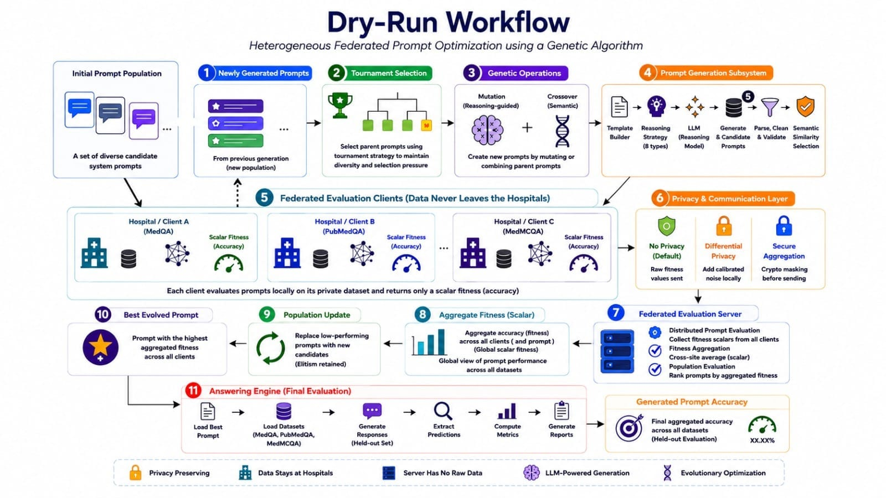

# FedGAPrompt: Federated Genetic Algorithm for Prompt Optimization

**Heterogeneous Federated Prompt Optimization (HFPO)** — A privacy-preserving framework that evolves system prompts across isolated medical institutions using genetic algorithms, without sharing patient data.

---

## Overview

FedGAPrompt solves a critical challenge in medical AI: **how to optimize prompts for clinical tasks when patient data cannot leave hospital servers**.

- **Federated**: Each "hospital" evaluates prompts on its own private dataset locally. No raw data, predictions, or model internals leave the hospital.
- **Genetic Algorithm**: Prompts evolve over generations via mutation, crossover, and elitism — guided by aggregated fitness scores from all hospitals.
- **Heterogeneous**: Each hospital uses a *different* medical dataset (MedQA, PubMedQA, MedMCQA), so prompts generalize across question distributions.
- **Adaptive Mutation**: Mutation strategies themselves evolve via meta-mutation, discovering better prompt-editing tactics over time.

---

## What Problem Does It Solve?

| Challenge | FedGAPrompt Solution |
|-----------|---------------------|
| Patient data cannot leave hospital networks | Federated evaluation — only aggregate fitness scores are shared |
| Prompts optimized on one dataset don't generalize | Heterogeneous federation — each hospital has a different medical QA dataset |
| Manual prompt engineering is slow and brittle | Genetic algorithm evolves prompts automatically over generations |
| Fixed mutation strategies limit exploration | Adaptive mutation — mutation prompts evolve via meta-mutation |
| No visibility into *why* prompts improve | Lineage tracking + parent-child fitness deltas + prediction agreement logs |

---

## Real-World Applications

- **Medical LLM Research**: Benchmark federated prompt optimization across institutions
- **Clinical Decision Support**: Evolve prompts that generalize across diverse patient populations
- **Medical Education**: Generate high-quality prompts for student-facing QA systems
- **Healthcare Documentation**: Optimize prompts for clinical note summarization without sharing PHI
- **Privacy-Preserving AI**: Template for federated optimization in any sensitive domain

---

## Features

- **Multi-Hospital Federated Evaluation**: 3 hospitals (MedQA, PubMedQA, MedMCQA) with isolated datasets
- **Genetic Algorithm Core**: Population-based evolution with tournament selection, elitism, mutation, crossover
- **Adaptive Mutation Engine**: 8 seed mutation strategies + meta-mutation evolution every N generations
- **Comprehensive Logging**: Generation snapshots, best prompts, parent-child diagnostics, mutation statistics
- **Checkpoint/Resume**: Full state persistence — resume from any generation
- **Quantized Model Support**: 4-bit quantization via bitsandbytes for consumer GPUs
- **Multiple Model Backends**: Qwen, Phi-4, Llama-3, Mistral, Meditron, II-Medical, GPT-OSS

---

## Quick Start

### Installation

```bash
# Clone and install dependencies
git clone https://github.com/your-org/FedGAPrompt.git
cd FedGAPrompt
pip install -r requirements.txt

# Set up Hugging Face token (for gated models)
echo "HUGGINGFACE_TOKEN=your_token_here" > .env
```

### Run a Full HFPO Experiment

```bash
# Run 20 generations with default config (Qwen3-8B, population=20)
python -m experiments.run_evolution

# Resume from latest checkpoint
python -m experiments.run_evolution --resume
```

### Run Baseline Comparisons

```bash
# Centralized (non-federated) baseline
python -m experiments.run_baseline

# Random search baseline
python -m experiments.run_random_search

# Centralized ablation study
python -m experiments.run_centralized_ablation

# Answering engine (non-evolutionary)
python -m experiments.run_answering_engine
```

---

## Configuration

All tunable parameters live in `configs/config.py`:

### Model Selection
```python
DEFAULT_MODEL = "qwen"  # Options: qwen, phi-4, llama3-8b, mistral-7b, II-medical, meditron, oss
```

### Genetic Algorithm
```python
GA_POPULATION_SIZE = 20
GA_GENERATIONS = 20
GA_MUTATION_RATE = 0.35
GA_CROSSOVER_RATE = 0.65
GA_TOURNAMENT_SIZE = 3
ELITE_COUNT = 2
```

### Adaptive Mutation
```python
USE_ADAPTIVE_MUTATION = True
MUTATION_EVOLUTION_INTERVAL = 5      # Generations between meta-mutation
MUTATION_TOURNAMENT_SIZE = 3
MUTATION_ELITE_COUNT = 2
MIN_CHILDREN_FOR_RANKING = 10
TOP_CHILDREN_TO_KEEP = 5
```

### Evaluation
```python
EVALUATION_SUBSET_SIZE = 100         # Samples per hospital per prompt
RANDOM_SEED = 51
```

### Generation Parameters
```python
MAX_NEW_TOKENS = 256
TEMPERATURE = 0.2
```

---

## Workflow 



### Core Components (`src/`)

| Module | Responsibility |
|--------|----------------|
| `core/` | Evolutionary data structures: `PromptCandidate`, `Population`, `FitnessVector`, `LineageTracker`, `EvaluationCache`, `MutationPromptManager` |
| `federated/` | `FederatedServer` (coordinator), `HospitalClient` (isolated evaluator), `Aggregator` |
| `evolution/` | `EvolutionEngine`, `PromptGenerator`, `TournamentSelector`, `Elitism`, mutation prompt evolution |
| `evaluation/` | `Evaluator` protocol, `QwenEvaluator`, metrics, parsers |
| `data/` | Medical dataset loaders: MedQA, PubMedQA, MedMCQA |
| `llms/` | Model loading with 4-bit quantization |
| `answering_engine/` | Centralized baseline (non-federated) |

---

## Output Files

```
results/hfpo_run/
├── best_prompts/
│   └── best_prompt.txt           # Highest-fitness prompt discovered
├── checkpoints/
│   └── gen_*.pkl                 # Pickled Population for --resume
├── snapshots/
│   ├── gen_*.json                # Full generation state
│   └── gen_*.csv                 # Tabular summary for analysis
├── parent_child_diagnostics.jsonl # Fitness deltas + prediction agreement
└── mutation_statistics.json       # Mutation operator performance tracking
```

---

## Example Output

**Best Prompt (`best_prompt.txt`)**:
```
You are a board-certified physician specializing in internal medicine. 
When answering medical licensing exam questions:
1. Identify the clinical scenario and key findings
2. Apply diagnostic reasoning: differential diagnosis → most likely → why
3. Eliminate distractors using evidence-based guidelines
4. State the final answer as a single letter (A/B/C/D/E)
5. Provide a concise justification referencing pathophysiology
```

**Generation Snapshot (`snapshots/gen_15.csv`)**:
```csv
generation,prompt_id,origin,avg_fitness,min_fitness,max_fitness,text_preview
15,abc123,mutation,0.78,0.72,0.85,"You are a board-certified..."
15,def456,crossover,0.75,0.68,0.81,"As an experienced clinician..."
15,ghi789,elite,0.82,0.77,0.88,"You are a medical expert..."
```

---

## Requirements

- Python 3.10+
- PyTorch with CUDA
- `bitsandbytes` (4-bit quantization)
- `transformers`, `accelerate`, `peft`
- `datasets` (Hugging Face) for MedQA, PubMedQA, MedMCQA
- Standard scientific stack: `numpy`, `pandas`, `scipy`

```bash
pip install -r requirements.txt
```

---

## Experiment Tracking

| Script | Purpose | Output Location |
|--------|---------|-----------------|
| `run_evolution.py` | Main HFPO run | `results/hfpo_run/` |
| `run_baseline.py` | Centralized GA baseline | `results/centralized_baseline/` |
| `run_random_search.py` | Random search baseline | `results/random_search/` |
| `run_centralized_ablation.py` | Federated vs centralized | `results/centralized_ablation/` |
| `run_answering_engine.py` | Non-evolutionary QA | `results/answering_engine/` |

---

## Citation

```bibtex
@misc{fedgaprompt2024,
  title={FedGAPrompt: Federated Genetic Algorithm for Prompt Optimization},
  author={...},
  year={2024},
  note={Heterogeneous Federated Prompt Optimization for Medical LLMs}
}
```

---

## License

MIT License — see `LICENSE` for details.

---

## Contributing

1. Fork the repository
2. Create a feature branch (`git checkout -b feature/amazing-feature`)
3. Commit changes (`git commit -m 'Add amazing feature'`)
4. Push to branch (`git push origin feature/amazing-feature`)
5. Open a Pull Request

---

## Acknowledgments

- Hugging Face for model hub and `datasets` library
- bitsandbytes for 4-bit quantization
- Medical QA dataset creators: MedQA, PubMedQA, MedMCQA teams
- Qwen, Phi, Llama, Mistral, Meditron model authors